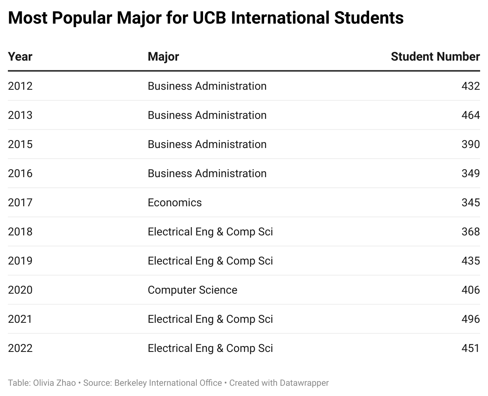

 # J296-DATA-JOURNALISM FINAL PROJECT
 By Olivia Zhao
 
 # Story Summary
Every year, thousands of international students from all over the world come to the US to pursue a higher education. With its reputation as a leading research institution, UC Berkeley has long been a sought-after destination for international students seeking a world-class education. 

According to [Open Doors Report](https://opendoorsdata.org/data/international-students/leading-institutions/), UC Berkeley ranked 11th among the leading institutions hosting international students in the United States in 2022. It has attracted a diverse pool of students from various countries and backgrounds, making it a hub for cross-cultural exchange and academic exploration. 

In this data analysis, I will delve into the experiences of international students at UC Berkeley, examining their demographics, academic pursuits, and challenges faced while studying in the United States.

The COVID-19 pandemic has had a significant impact on international students across the United States, including those at UC Berkeley. With travel restrictions, visa processing delays, and shifting immigration policies, many international students faced significant hurdles in coming to the States. Many international students chose to withdraw or take a gap year, due to challenges posed by remote learning such as time zone differences, access to reliable internet, and isolation from their support networks. But [research shows](https://opendoorsdata.org/annual-release/international-students/) that new international student enrollments have returned to pre-pandemic levels.

Aria Yang is an international student from China. She is one of many students who applied in 2020 but defered their enrollment to 2021. She says she's excited about the admission but didn't want to go to Zoom University, especially since there's a 15-hour time difference between California and China, which means she would have to wake up in the middle of the night to take her class.

Recently, [the Senate's budget subcommittee on education introduced a proposal](https://sbud.senate.ca.gov/sites/sbud.senate.ca.gov/files/05.12.2021_Hearing%20Agenda.pdf) that aims to decrease the proportion of out-of-state students admitted to the University of California system over the next 12 years. This plan calls for a gradual reduction in out-of-state enrollment, starting in the 2022-23 academic year, with a target of capping out-of-state enrollment at 10% of incoming freshmen by 2033-34.  

I asked Erin Skelly, Assistant Director for Student Services at Berkeley International Office, if this would impact the international students admission at Berkeley. She says it certainly would, but it's not uncommon for this kind of legislature to adjust in the future.

"This is always a political football," says Skelly. On the one hand, public schools like University of California receive money from the state and they are there to educate the children of that state; on the other, a lot of the funding of the university comes from in-state tuition and international student tuition who pay those nonresident fees. 

"It's up and down. The legislature will pass this, and maybe in a few years, it'll adjust again. So it's just kind of something that we see come and go in international education." says Skelly. "But you know, being a world class university that has diversity and students of brightest minds from all over the world, I will say that whatever the cap is we will meet it easily."

# Data Diary
## 1. Data Gathering
To get the international student data of UC Berkeley, I wrote to the Berkeley International Office (email address: internationaloffice@berkeley.edu) asking for the following data in cvs/xlxs form:
-   **Data on admission and enrollment of new, degree-seeking international students (freshmen, transfer, graduate) from 2005 through 2022, including applied, admitted, intend to register.**  
-   **Total enrollment of international students from 2005 to 2022**  
-   **Education levels of international students from 2005 to 2022**  
-   **All non-immigrant international students by visa type from 2005 to 2022**  
-   **Country of origin of international students from 2005 to 2022**  
-   **Intended degree-seeking program/majors of international students from 2005 to 2022**

They then passed my request on to the UC Berkeley Public Records Office, and after 12 days, I received the cvs file.

NOTICE: **The file they gave me is missing the data for 2014. I wrote an email but haven’t heard back from them yet.**

You can find the raw data [here](BIO public records request.xlsx) and my cleaned up data [here](BIO_MASTERSHEET_CLEAN.xlsx).

### Data from other sources
- [Open Doors Report](https://opendoorsdata.org/data/international-students/leading-institutions/)
- [University of California Freshman Admit Data](https://admission.universityofcalifornia.edu/campuses-majors/freshman-admit-data.html)

### Potential interviewees
- Erin Skelly: Assistant Director for Student Services at BIO (Email: eskelly@berkeley.edu)
- Aria Yang: international student at UC Berkeley Graduate School of Journalism. (Twitter: @AriaYang5)

## 2. Data Cleaning
### 2.1 Formatting the raw data to be imported
- we need 4 columns from every tab, from left to right: Visa Type, Country of Citizenship, Intended Major, Education Level
- Creating a mastersheet by combining all the separate tabs together. Use IMPORTRANGE (not IMPORTHTML)
- Since IMPORTRANGE effectively link the mastersheet to all the other sheets, it cannot be edited manually. So we copy paste (value only) the data to another sheet. This step may take a bit of time.
### 2.2 Initial cleanup
- Open Data -> Data cleanup. It automatically suggests some naming traditions of the countries.
- After consulting the BIO office, we can cluster undergrads and bachelors as they are the same thing.
- At first glance, we can see that some students have 2 or 3 intended majors. To facilitate data analysis, we split text to column by comma.
- However, when we tried to split text to column by comma, we ran into problems. Some majors might have comma in themselves, for example: ENVIRONMENTAL SCIENCE, POLICY, AND MANAGEMENT(UCB 04:683, CIP 03.0103).
![[Screen Shot 2023-04-16 at 1.02.24 PM.png]]
- Also notice that this kind of older data are in all capital letters, with a trailing code (UCB 04:683, CIP 03.0103). We don't want that, so we have to manually find-and-replace them (that takes about two days).
### 2.3 Find and Replace
- Find and Replace "BA" "BS" "MBA" "MPH" "PhD" "MTM" with empty space (remember to tick the box for Match Case)
- In order to use Regex on (Subplan: xxxxx) we have to do the following steps:
	- Find and Replace **(Subplan:** with **#** 
	- Find and Replace **#*** with empty space (Match Case and Regex)

## 3. Data Analysis
Now that we have cleaned up the data, we are ready to do some data analysis. 

Create a pivot table, using Country of Citizenship (or other category that I want to analyze) as Rows (order: Ascending), Visa Type as Values (Summarize by: COUNTA), and adding Year as Filters.

Some of the questions that I'm curious about:
- How many international students are coming to the UCB each year?
- Among them, how many are on F1 visa and how many on J1 visa?
- Among them, how many are studying for Bachelors, Masters, and PhDs?
- Where do they come from? What's the most popular country of citizenship?
- What are they studying? What's the most popular major each year? Does that change over time?
- How does COVID-19 or other global affairs impact the international students makeup of UCB?

## 4. Questions to be answered
### 4.1 How many international students are coming to the UCB each year?

- The COVID time period was highly disruptive for students, but it bounced back pretty quickly.

### 4.2 Among them, how many are on F1 visa and how many on J1 visa?

- F-1 is the most common visa status used by students in the U.S. and best fits a student's situation.
- J-1 visa status is generally used for students in specific educational exchange programs such as the UC Education Abroad Program (EAP), Fulbright, LASPAU, DAAD, AmidEast, or others. To be eligible for a J-1, students must receive a majority of their financial support from sources other than personal funds.
- According to [Berkeley International Office](https://internationaloffice.berkeley.edu/students/new/fj_compared), most international students at UC Berkeley have F-1 status.

### 4.3 Among them, how many are studying for Bachelors, Masters, and PhDs?

- Many students actually already have a masters degree back home, but they're coming to UC Berkeley to pursue a second graduate degree.
- Erin Skelly confirms that some of the biggest growth is in graduate professional programs. Specifically, a lot of graduate masters and professional programs. 
- "So what you may be seeing is that folks have a working professional degree back home and they're wanting to connect to the US and possibly US work potential later. " says Skelly.

### 4.4 Where do they come from? What's the most popular country of citizenship?

- China, India, and South Korea have consistantly been the leading international students places of origin at UC Berkeley.

### 4.5 What are they studying? What's the most popular major each year? Does that change over time?

- Before 2017, Business Administration is the most popular major.
- After 2017, it's Eletrical Engineering and Computer Science.

For future reporting, it would be interesting to find out how other global affairs impact the international students makeup of UCB. For example, India has surpassed South Korea to become the second most popular country of origin. Will it surpass China in the future too?
[Guardian | India overtakes China to become world’s most populous country](https://www.theguardian.com/world/2023/apr/24/india-overtakes-china-to-become-worlds-most-populous-country)  
[New York Times | Can India Become the Next Global Superpower?](https://www.nytimes.com/2023/04/27/podcasts/the-daily/india-population-superpower.html)
